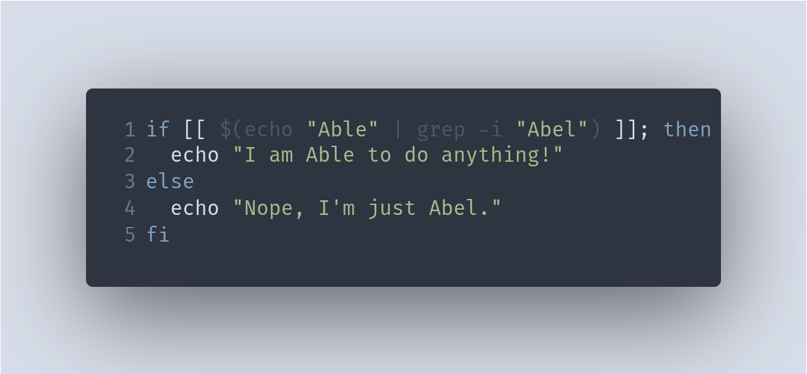

  
  
  

# Hi, I'm Abel! 👨‍💻

I'm a **DevOps/Systems Engineer** with a strong focus on **Kubernetes** and **Cloud technologies**.
I enjoy optimizing infrastructure and automating workflows.

### 🛠️ Skills

- **Kubernetes** – Building and maintaining containerized applications at scale.
- **Cloud Technologies** – Expertise in cloud platforms like AWS and GCP.
- **Programming Languages**: Python, Go, Rust.
- **Automation** – Streamlining workflows with CI/CD pipelines and infrastructure as code.
- **Systems Engineering** – Managing and optimizing large-scale systems and servers.

---

